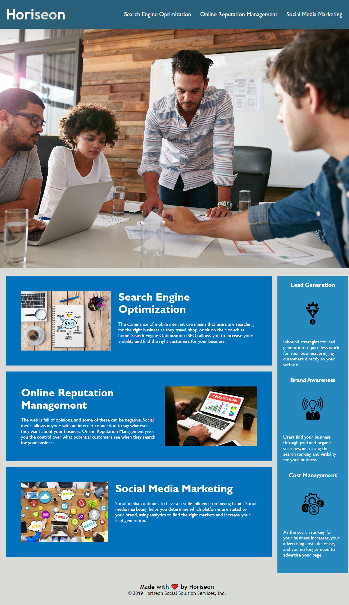

# horiseon-code-refractor

## Description

Improve the accessibility of the website for people with disabilites and to optimize the website for search engines.

## Improvements

- Renaming title to clearly indicate what site is shown
- Adding alt text to all relevant images
- Reorganized the CSS codes from top to bottom in the order of global-elements-classes
- Combined repeating properties into one attribute command (4 sections)

---

[Horiseon website]()